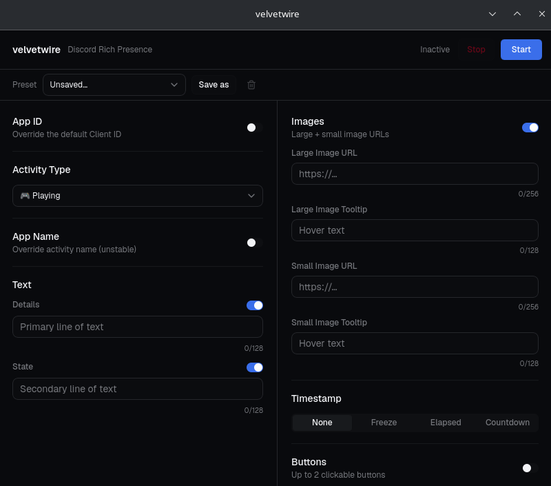

# velvetwire

Set a custom Discord Rich Presence without writing any code.



## Download

Get the latest installer for your platform from the [Releases](https://github.com/FortiBrine/velvetwire/releases) page.

> Requires the Discord desktop app. The browser version does not support Rich Presence.

## Features

- Activity types: Playing, Listening, Watching, Competing
- Text fields for Details, State, and a custom App Name
- Large and small images with hover tooltips
- Timestamps: elapsed, frozen, or countdown with an optional time offset
- Up to 2 clickable buttons shown on your profile
- Named presets (up to 20), stored locally
- Your last configuration is loaded automatically on next launch
- Closes to the system tray instead of quitting

## Building from source

You need [Rust](https://rustup.rs), [Bun](https://bun.sh), and the [Tauri system dependencies](https://v2.tauri.app/start/prerequisites/) for your platform.

```bash
git clone https://github.com/FortiBrine/velvetwire.git
cd velvetwire
bun install
bun run tauri build
```

Installers go to `src-tauri/target/release/bundle/`.

To run with hot-reload during development:

```bash
bun run tauri dev
```

## Contributing

1. Fork the repo and create a branch from `main`.
2. Make your changes.
3. Run `bun run lint` (or `bun run lint:fix` to auto-fix) and `bun run check` for type errors.
4. Open a pull request describing what changed and why.

## License

MIT or Apache 2.0, at your option. See [LICENSE-MIT](LICENSE-MIT) and [LICENSE-APACHE](LICENSE-APACHE).
